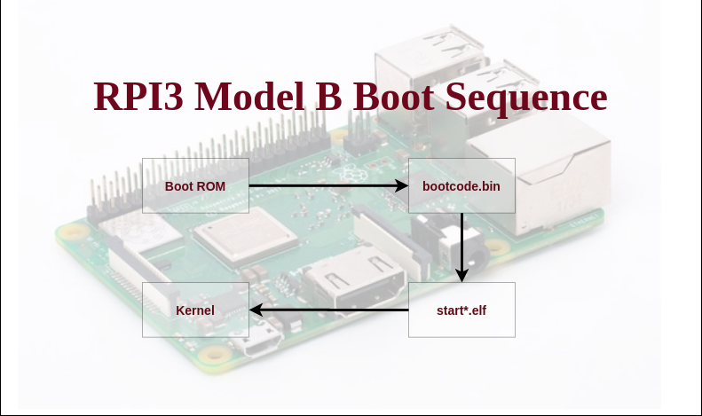

## نبذة عن المشروع
هذا المنشور هو الأول من سلسلة دورات تعليمية تهتم بشرح مبسط و عملي لكيفية تطوير نظام تشغيل بسيط في نوعه أين سنطرق باذن الله تعالى للعديد من المفاهيم الأساسية لكيفية عمل المعالجات من عائلة ARM انطلاقا من سلسلة التشغيل الأولية (Boot sequence) وصولا لتهيأة الأنشطة (Processes) و بقية لوازم النظام باستخدام لغة C.

##  الهدف منه
يوجد على الانترنت العديد من الدورات و المحتويات الممتازة المعتنية بنظريات أنظمة التشغيل و لكن للأسف نصيب المحتوى العربي منها شحيح للغاية بل يكاد يكون منعدما.
يسبب هذا النقص حاجزا نوعيا للعديد من غير المتمكنين من اللغات الأجنبية و المهتمين بهذا المجال و مع قناعتي بأن التعلم باللغة الأم هو السبيل الوحيد الذي يكسب المجتمعات تمكنا من العلوم يمكن أن يفضي الى انتاج للابداع لا استهلاكه فقط, قررت أن أبدأ ولو بطريقة بسيطة بانتاج محتوى يمكن أن يكون منطلقاللراغب في دراسة أو تطوير نظام تشغيل بسيط.
>لا بد من الاشارة الى أن الراغب في التعمق في دراسة معمارية المعالجات (Processor Architecture) و بقية المعارف المقرونة بها لا بد له من اتقان اللغة الانجليزية.

هذه السلسلة هي اجتهاد بشري قد تشوبه العديد من الأخطاء, فالرجاءالاشارة لأي خطأ و أدعو أي شخص مهتم للمساهمة في هذا المشروع لعله يحقق الفائدة المرجوة.

## المكونات و بيئة العمل
لمتابعة الدروس و تجريب الجانب التطبيقي, من المنصوح به توفر هاته المعدات و البرامج (Hardware/Software):
- برنامج VSCode مع اضافة ( extension) cortex-debug.
- لوحة Raspberrypi 3B+
- محول TTL to USB لاستعمال المنفذ التسلسلي لللوحة, بالنسبة لي استعملت Prolific Technology, Inc. PL2303 Serial Port / Mobile Action MA-8910P
- مصحح خارجي JTAG (external debugger) لتحميل الكود في ذاكرة المعالج الى جانب البحث عن الاخطاء البرمجية (Debugging).
من جانبي استعملت ltd FT232H Single HS USB-UART/FIFO IC 

## نبذة عن معالج اللوحة Boradcom bcm2837

تحتوي لوحة Rpi 3B+ على معالج من نوع Boradcom bcm2837 ذو 4 أنوية من معمارية aarch64 أو ARMv8-A و تحديدا cortex a53. تهمنا كثيرا تفاصيل المعالج الذي سينفذ نظامنا لأنه من وظائف النظام تهيئة البيئة اللازمة للتطبيقات و التي بدورها تعتمد على الخاصيات المتاحة من المعمارية.
لمزيد التفاصيل الرجاء قراءة هذا[الملخص لخاصيات اللوحة.](https://datasheets.raspberrypi.com/rpi3/raspberry-pi-3-b-plus-product-brief.pdf)  
تحتوي وثيقة معلومات المعالج (datasheet) على كل تفاصيل مكونات المعالج و كيفية تهيئة المكونات (peripherals) انطلاقا من السجلات (registers). [الوثيقة.](https://github.com/raspberrypi/documentation/files/1888662/BCM2837-ARM-Peripherals.-.Revised.-.V2-1.pdf)

ما يهمنا في الوقت الراهن أن المعالج من معمارية ARMv8A.

## تسلسل التشغيل الأولي للمعالج
 
ماذا يحدث عندما تضغط على زر التشغيل لحاسوبك ,هاتفك أو جهاز البلايستايشن لديك ؟ و هل يتأثر ذلك بنوعية نظام التشغيل الذي سيشتغل بعد لحظات ؟ حسنا الجواب المباشر: لا.

مرحبا بك في عالم التشغيل الأولي. نظام التشغيل هو عبارة عن برنامج مخزن في ذاكرة ما, و ما أي برنامج الا لائحة من الأوامر التي يفهمها المعالج و ينفذها حذو تسلسل منطقي, و لكن كيف يعرف المعالج من أي أمر يبدأ, خاصة و ان علمنا أن المعالجات عموما غير معتمدة على نظام محدد(OS agnostic), اذ يمكنك أن تنصّب linux أو Windows أو حتى نظامك الخاص.

### بوتلودر المستوى الأول (First Stage Bootloader)

هو عبارة عن برنامج مخزن عادة في ذاكرة مداومة (persistent memory) كFLASH أو ROM و يكون مطورا من قبل مصنّع اللوحة الأم و يكون عادة مُغلَق المصدر و يكون مصصمما لكي يكون أول الأوامر التي ينفذها المعالج, و وظيفته الأساسية هي تهيأة المعالج نفسه كتهيأة المقاطعات (interrupts) و أجهزة المعالج الرئيسية كمتحكم الذاكرة (MMU memory management unit) الى جانب تهيأة أجهزة الذاكرة المختلفة أين يمكن أن يقبع كود البوتلودر الثاني.

### بوتلودر المستوى الثاني (Second Stage Bootloader)

وظيفة البوتلودر الثاني الرئيسية هي تحميل نظام التشغيل الى الذاكرة العشوائية (RAM) ثم اعطائه السيطرة, طبعا يتيح البوتلودر الثاني عدة طرق أو واجهات لذلك, مثلا من خلال المدخل التسلسلي أو من خلال بطاقة SD اذا كانت تحتويها اللوحة الام, كذلك من خلال الشبكة عن طريق مدخل ال ethernet أو الUSB.
يمكن أن نستنتج ضمنيا اذا ان البوتلودر مكلف بتهيأة كل هاته الأجهزة و المداخل. يكون عامة مفتوح المصدر و من مهام المطور أن يوفره كمعلومة ادخال (input) للبوتلودر الأول.
بعض الأمثلة المشهورة: 
- [U-Boot](https://www.denx.de/wiki/U-Boot)
- [GRUB](https://www.gnu.org/software/grub/)
- [UEFI Bootloaders](https://wiki.osdev.org/UEFI) ...
###  سلسلة التشغيل ل Raspberrypi 3B+

عند التدقيق في وثيقة البيانات للمعالج نرى أن الfirmware و هو الذي يلعب دور البوتلودر الأولي يتم تنفيذه من قبل المعالج الفيديوي (Video Core / GPU) و أول ما 
يفعل هو تهيأة قارئ الSD و من ثم البحث عن ملف bootcode.bin داخل بطاقة الذاكرة و ينفذه.

 - **ملف bootcode.bin**:
 في الحقيقة لم أجد معلومات كبيرة حول وظائف هذا الكود الثنائي (binary code) و لكن ما أمكن استنتاجه أن من وظائفه قراءة الاختيارات من ملف config.txt, و ان وجد معلومات عن البوتلودر التالي فسيتم تحميله الى الram و الا فسيتم تحميل الملف باسم *start.elf*.
 
  - **ملفي start.elf و fixup.dat**:
  هو اخر برنامج يتم تنفيذه قبل كود المستعمل (نظام التشغيل), و وضيفته الرئيسية هي تهيأة اجهزة المعالج وفف الاخنيارات الموجودة في ملف config.txt و في الاخير تحميل الكود الثنائي للمستعمل والذي غالبا ما يكون نواة نظام التشغيل (Operating system kernel) و لوازمه ان وجدت كشجرة الاجهزة بالنسبة للينوكس (device tree blob).
يتوقع ملف النواة أن يحمل اسم kernel8.img و لكن يمكن تغيير ذلك في ملف الاختيارات.

  - **ملف kernel8.img**:
كما تمت الاشارة فهذا الملف هو الصيغة النهائية **المُجمعًّة** (Compiled final version) لمصادر نظام التشغيل(OS sources).
بالنسبة لهاته الدروس لن نستعمل ملف نواة لينوكس بل سنطور نواتنا من الصفر.

> كل الملفات اللازمة للتشغيل الأولي ما عدى ملف النواة (bootcode.bin, start.elf, fixup.dat) هي برامج مغلقة المصدر مطورة من قبل مٌصنّعي Raspberrypi, و يمكن تحميلهم من [هنا.](https://github.com/raspberrypi/firmware/tree/master/boot)
