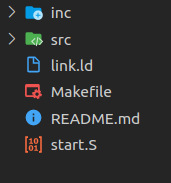

الدرس الثاني: كتابة البرنامج الأول 

# تنظيم مجلد المشروع

سنحاول قدر المستطاع تهيأة بيئة سهلة لتنظيم ملفات المصادر و بالتالي فنستعمل مجلد *src* لملفات المصدر أو *.c و *inc* لملفات التعريفات أو header files. 
أما بالنسبة للملفات المتعلقة بالتهيأة أو البناء (configuration and build) فستبقى في المجلد الرئيسي (root folder) و بما أننا سنستعمل make لبناء الصورة النهائية
فيكون التنظيم على النحو التالي:

- ملف **Makefile** :
هو الملف المسؤول عن بناء الصورة النهائية من خلال تجميع (compiling) جميع المصادر اللازمة عن طريق gcc و من ثم ربطها جميعا في ملف واحد باستعمال المعلومات الموجودة في ملف **link.ld** 
و التي تتحكم في أماكن الذاكرة لكل شيئ مصدري (object) كأماكن الدالات (functions) و المتغيرات العامّة (global variables) الي غير ذلك.
لمزيد الاطلاع على كيفية عمل التجميع و الربط يرجى قراءة هذا المقال المبسط [من هنا.](https://medium.com/@bdov_/what-happens-when-you-type-gcc-main-c-a4454564e96d)
